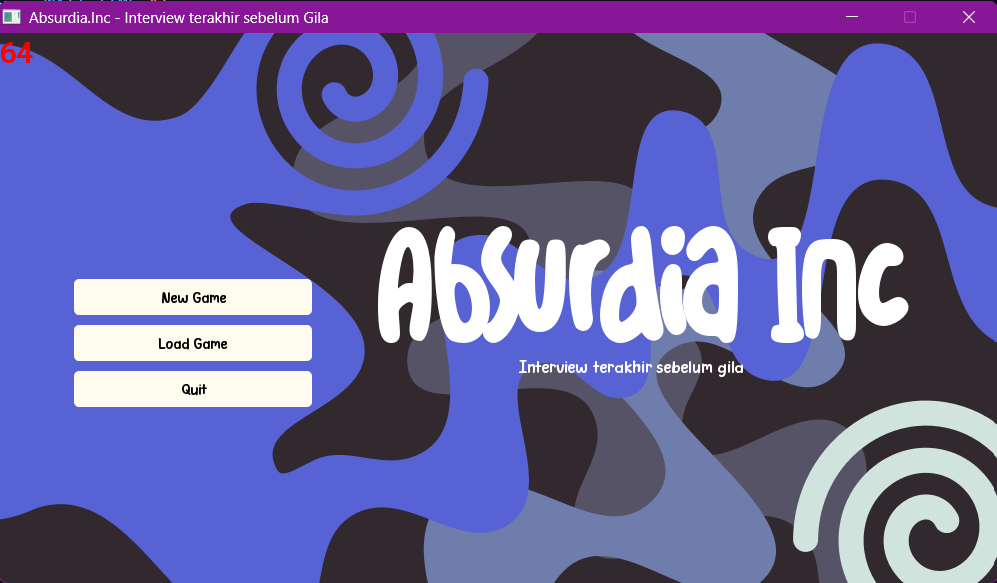

Project UAS SDA

# Introduction

Game ini merupakan sebuah game visual novel interaktif yang mengajak pemain memilih jalur cerita berdasarkan keputusan-keputusan yang mereka ambil.

Setiap pilihan membawa pemain ke cabang cerita yang berbeda, dengan kemungkinan kembali ke titik sebelumnya.

### Apa itu Visual Novel?

Visual novel adalah jenis permainan yang fokus pada penceritaan dan pengembangan karakter. Pemain berinteraksi dengan cerita melalui pilihan dialog, keputusan, dan tindakan yang dapat memengaruhi alur cerita. Sistem akan menampilkan narasi tekstual dengan ilustrasi statis atau animasi, dan seringkali dikaitkan dengan media permainan video.
